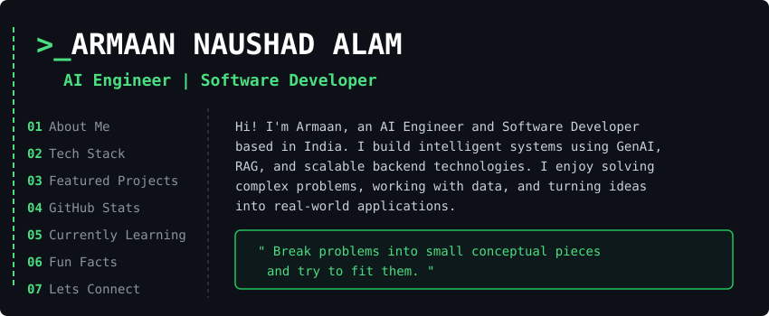

  

<h3 align="center">Let's Connect</h3>

  
  
  
  
  

### ❯ Tech Stack

**Languages:** 

 **Frameworks & Libraries:** 
    

 **Databases:** 

 **Tools & Platforms:** 

### ❯ Featured Projects
<!-- START_SECTION:featured_projects -->
<table width="100%">
  <tr>
    <td width="50%" valign="top">
      
    </td>
    <td width="50%" valign="top">
      
    </td>
  </tr>
  <tr>
    <td width="50%" valign="top">
      
    </td>
    <td width="50%" valign="top">
      
    </td>
  </tr>
</table>
<!-- END_SECTION:featured_projects -->

### ❯ Stats
<table width="100%">
  <tr>
    <td width="50%" valign="top">
      
    </td>
    <td width="50%" valign="top">
      
    </td>
  </tr>
  <tr>
    <td width="50%" valign="top">
      
    </td>
    <td width="50%" valign="top">
      
    </td>
  </tr>
</table>

